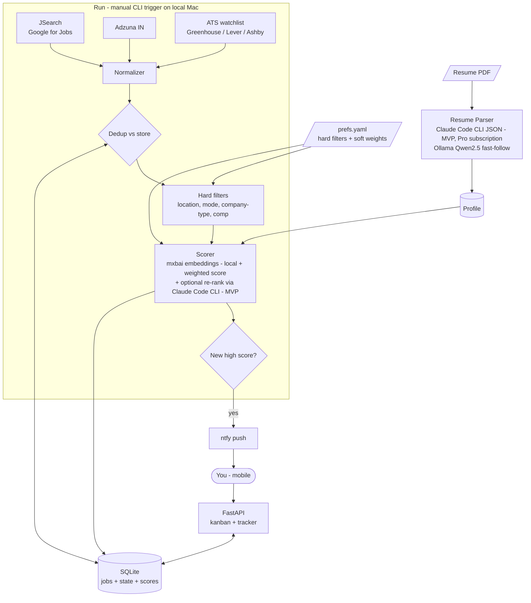

# Job-Hunt Copilot — v1 High-Level Design

## 1. Summary

A self-hosted agent that turns a resume + a preferences file into a continuously-updated, ranked shortlist of jobs, grouped by work mode and location, and tracks each role through to application. v1 builds the **spine only**: discover → score → triage → track. It runs locally on my Mac, manually triggered for v1 (moving to a scheduled run once the spine is proven), pushes new high-scoring matches to ntfy, and exposes a small mobile-friendly board for triage and tracking. Text-generation LLM work (resume structuring, optional re-rank) uses the **Claude Code CLI, authenticated via my existing Claude Pro subscription, for MVP** — no separate API billing — to get to a working pipeline fast; migrating that to a fully local Ollama stack (Qwen2.5) is a committed fast-follow, not a maybe. Embeddings run locally (`mxbai-embed-large`) from day one in both phases. `prefs.yaml`, the derived profile, and all tracking state never leave the machine; resume and job-description text sent to Anthropic via Claude Code for parsing/re-rank is the one deliberate exposure of MVP.

The copilot features that make this a "copilot" rather than a "matcher" — resume tailoring, interview-prep handoff, and a company-research agent — are deliberately **out of v1** and layered on once the spine proves itself.

---

## 2. Goals / Non-goals

**Goals**
- Surface roles I'd actually want (Staff/Principal backend, Bangalore or remote, product companies and GCCs) with the noise (service/consultancy shops) filtered out.
- Be a *monitor*, not a one-shot search: remember what I've seen and only alert on genuinely new, high-scoring roles.
- Explain *why* each role ranked where it did.
- Run locally on my own machine, manually triggered for v1; reuse the ntfy channel I already trust.

**Non-goals (v1)**
- No resume tailoring or cover-note generation.
- No interview-prep handoff.
- No agentic company research.
- No implicit learning of weights from my triage decisions.
- Never: auto-apply; LinkedIn scraping.

---

## 3. Scope

**In v1**
- Resume → structured profile (one-time).
- `prefs.yaml`: hard filters + soft weights, hand-editable.
- Discovery from JSearch + Adzuna; pluggable source interface so the ATS watchlist slots in last.
- Dedup across sources and across runs.
- Hard-filter gate, then embedding-based weighted scoring.
- SQLite store with per-job state.
- Manual-trigger orchestration (CLI) + ntfy alerts on new high scorers.
- FastAPI board: triage (New → Interested/Skip) and tracker (Interested / Applied / Interviewing).

**Out of v1** (fast-follow order): automatic scheduling (launchd/cron) → migrate resume-parsing/re-rank from Claude Code CLI to local Ollama → ATS watchlist hardening → LLM re-rank quality pass → implicit weight learning → resume tailoring → interview-prep handoff → company-research agent.

---

## 4. Architecture



The whole thing is a deterministic state machine over a SQLite table. The only LLM touchpoints are resume structuring (once) and an optional re-rank of the top shortlist — both cacheable, both sitting behind a swappable provider interface. MVP defaults that interface to the Claude Code CLI (via the already-owned Pro subscription, not metered API billing) for speed of delivery; local Ollama (Qwen2.5) is the committed fast-follow target. Embeddings are local (`mxbai-embed-large`) in both phases. Everything else is plain Python.

---

## 5. Components

**Resume Parser** — One-time. `pypdf` extracts text; the Claude Code CLI (`claude -p`, non-interactive mode, JSON output, authenticated via the existing Claude Pro subscription — no API key) returns a structured `Profile` in MVP, behind a provider interface that swaps to local Ollama (Qwen2.5) once the pipeline is proven. Persisted so it's not re-run each cycle regardless of provider.

**Preferences (`prefs.yaml`)** — The piece that makes this beat a generic matcher, since none of my actual wants live in a PDF. Seeded by a short one-time guided interview, then hand-editable. Holds hard filters (gate) and soft weights (tune scoring).

**Discovery** — Scheduled fetchers behind a common `JobSource` interface:
- JSearch (Google-for-Jobs aggregate; best India coverage).
- Adzuna (India endpoint).
- ATS watchlist — Greenhouse/Lever/Ashby endpoints for target companies (Razorpay, Swiggy, Adobe, …). Catches postings on day one, before aggregators. Slots in last because it's per-company fiddly, but architecturally it's a first-class source.

**Normalizer** — Maps each source's payload to a canonical `Job`, including a best-effort work-mode classification (remote/hybrid/onsite — reliable on JSearch's `job_is_remote`, text-inferred on Adzuna).

**Dedup** — Idempotency key per job; checked against the store so reruns don't re-alert. Key = source id when stable, else `title|company|city`.

**Scorer** — Hard filters gate first (cheap, removes most noise). Survivors are embedded locally with `mxbai-embed-large` and scored (see §7) — embeddings stay local in both MVP and fast-follow, since Claude has no embeddings endpoint. Optional re-rank of the top ~25 adds a one-line reason per role, via the Claude Code CLI (Pro subscription) in MVP and local Ollama once that fast-follow lands.

**Store (SQLite)** — Single source of truth: jobs, scores + breakdown, state, timestamps. This is what turns "search" into "monitor."

**Orchestrator** — Each run: discover → normalize → dedup → filter → score → persist → detect new high scorers → notify. Triggered manually via CLI in v1. Per-source try/except so one dead source doesn't kill the run.

**Notifier** — ntfy push to the existing Pi channel on new roles above threshold.

**Surface (FastAPI + minimal web board)** — Mobile-first. Triage swipes New into Interested/Skip; tracker shows Interested / Applied / Interviewing. Each card shows score, why-matched (matched skills + re-rank reason), and the apply link.

---

## 6. Data model

**`Job` (SQLite `jobs`)**
| field | notes |
|---|---|
| `id` | dedup key |
| `source` | jsearch / adzuna / ats |
| `title`, `company`, `location`, `city`, `country` | normalized |
| `work_mode` | remote / hybrid / onsite |
| `description`, `employment_type`, `salary`, `apply_url` | |
| `score`, `breakdown` (JSON), `matched_skills`, `reason` | explainability |
| `state` | new / interested / skipped / applied / interviewing / rejected |
| `first_seen`, `last_seen`, `updated_at` | |

**`prefs.yaml` (shape)**
```yaml
hard_filters:
  locations: [Bangalore, Remote]
  work_modes: [remote, hybrid, onsite]
  company_types_allow: [product, gcc]
  company_types_deny:  [services, consultancy, staffing]
  comp_floor_lpa: 60
  seniority_floor: senior        # drop anything below

soft_weights:                    # desirability tuning, sum ~1.0
  work_life_balance: 0.40
  stability:         0.30
  scope:             0.20
  comp:              0.10

alerting:
  score_threshold: 0.70
  max_alerts_per_run: 10
```

---

## 7. Scoring model

Two stages, filter-before-score so the LLM never touches junk.

1. **Hard filters** (boolean gate from `prefs.yaml`): location, work mode, company type, comp floor, seniority floor.
2. **Composite score** on survivors:

```
final = w_q * match_quality  +  w_d * desirability
```

- **match_quality** = semantic similarity (resume vs JD embeddings) + skill overlap + seniority fit. This is objective and JD-derivable.
- **desirability** = company-type fit (product/GCC > services) + comp fit + work-mode/location fit + optional employer rating (JSearch surfaces Glassdoor data). The `soft_weights` tune this sub-blend.

**Honest caveat:** WLB and stability aren't directly extractable from a JD. v1 *proxies* them — mainly through the product-vs-services company-type filter, which is the single biggest real-world lever — rather than pretending to measure them. Tightening this is a v2 job (employer signals, layoff/news checks in the research agent).

Score breakdown is persisted per job, so ranking is always explainable.

---

## 8. Operational model

- **Schedule:** v1 is manually triggered via CLI on the local Mac. Fast-follow: move to `launchd` (preferred over cron on macOS for logging/retry) once the spine is proven.
- **Idempotency:** dedup key + `first_seen`; reruns update `last_seen`, never re-alert.
- **Rate limits:** aggregator free tiers are capped — bound queries/run, cache responses, back off on 429.
- **Failure handling:** per-source isolation; partial results are valid; run logs to a file ntfy can tail on error.
- **Cost:** MVP uses the already-owned Claude Pro subscription (via Claude Code CLI, `claude -p`) for resume parsing (one-time) and optional re-rank (top ~25/run) — **zero incremental spend**, no separate API billing to provision. That usage draws from a quota shared with ordinary claude.ai use, so v1 stays manually-triggered and bounded rather than continuous. Embeddings (`mxbai-embed-large`) run locally at zero cost regardless. Fast-follow: swap resume parsing + re-rank to local Ollama (Qwen2.5), removing the shared-quota dependency entirely.
- **Privacy:** `prefs.yaml`, the derived profile, and all tracking state stay on the local machine in every phase. MVP's one deliberate exposure: resume text and job-description text are sent to Anthropic via the Claude Code CLI for parsing/re-rank; this closes once the local-Ollama fast-follow lands.

---

## 9. Tech stack

Python 3.11+ · FastAPI · SQLite · httpx · pypdf · NumPy · Claude Code CLI (`claude -p`, via Claude Pro subscription; resume structuring + optional re-rank, MVP) · Ollama (`mxbai-embed-large` for embeddings, always; `Qwen2.5 14B` as the local-LLM fast-follow target) · ntfy, running on the local Mac. Manual CLI trigger in v1; `launchd` scheduling is a fast-follow. Deterministic pipeline — **no agent framework in v1**.

---

## 10. Milestones

| # | Deliverable |
|---|---|
| M1 | Resume parser (Claude Code CLI via Pro subscription) + `prefs.yaml` schema + SQLite schema |
| M2 | Discovery (JSearch + Adzuna) + normalizer + dedup |
| M3 | Scorer (hard filters + local embeddings + weighted composite + optional re-rank via Claude Code CLI) |
| M4 | Orchestrator (manual CLI trigger) + ntfy alerts |
| M5 | FastAPI triage/tracker board |
| — | *(then v2: automatic scheduling (launchd) → migrate resume-parsing/re-rank from Claude Code CLI to local Ollama → ATS watchlist → LLM re-rank quality pass → implicit learning → tailoring → prep handoff → research agent)* |

Live on M1–M5 for a few days before starting v2, so the spine earns its features.

---

## 11. Key decisions & tradeoffs

- **Deterministic pipeline over an agent framework.** The flow has no genuine branching in v1, so CrewAI would add KV/latency overhead for nothing. The agent loop is reserved for v2 company research, where open-ended tool use actually pays off.
- **Claude Code CLI via Pro subscription for MVP text-generation, local Ollama as the committed target.** No Anthropic API key is provisioned, and Pro-subscription auth can't call the Messages API directly — but Claude Code's non-interactive mode (`claude -p`) is Anthropic's officially supported path for scripted use under a Pro/Max login, so it's used as the MVP resume-parsing/re-rank engine instead. This gets v1 working fast at genuinely zero incremental spend (reusing an already-owned subscription rather than provisioning metered billing), bounded only by Pro's shared usage quota. The swap to Ollama sits behind the same provider interface and is a tracked fast-follow, not an open-ended someday — so the local-first destination doesn't quietly slip, and the shared-quota dependency goes away entirely. Embeddings (`mxbai-embed-large`) are local from day one regardless, since Claude has no embeddings endpoint and this piece was already free and private.
- **ATS watchlist as a first-class source.** For a directed search at named targets, aggregators lag by days; ATS endpoints don't. Deferred in build order, not in architecture.
- **Filter before score.** Keeps embedding/LLM cost proportional to *relevant* volume, not total volume.
- **Manual trigger before scheduling.** Ship the pipeline as a manually-invoked CLI command first; add `launchd` scheduling once the ranking and alerting logic is proven, so schedule-related failures don't hide inside a job nobody's watching.

---

## 12. Open questions

1. Hosting the FastAPI board — localhost-only, or exposed via a tunnel for off-network triage?
2. ATS watchlist seed list — fixed in `prefs.yaml`, or auto-expanded from the companies that show up in aggregator results?
3. Re-rank in v1, or ship pure-embedding ranking first and add the LLM pass only if quality demands it?
4. How to source the product-vs-services company-type label cheaply (curated list vs. a one-time LLM classification cached per company)?
5. When to move off manual triggering — after a fixed number of manual runs, or once a specific quality bar (e.g. false-alert rate) is met?
6. Migration trigger for Claude Code CLI → local Ollama — after a fixed number of validated runs, once local re-rank/parsing quality is benchmarked against Claude's output, when Pro-plan shared usage quota becomes a practical constraint, or on a fixed calendar date regardless?
