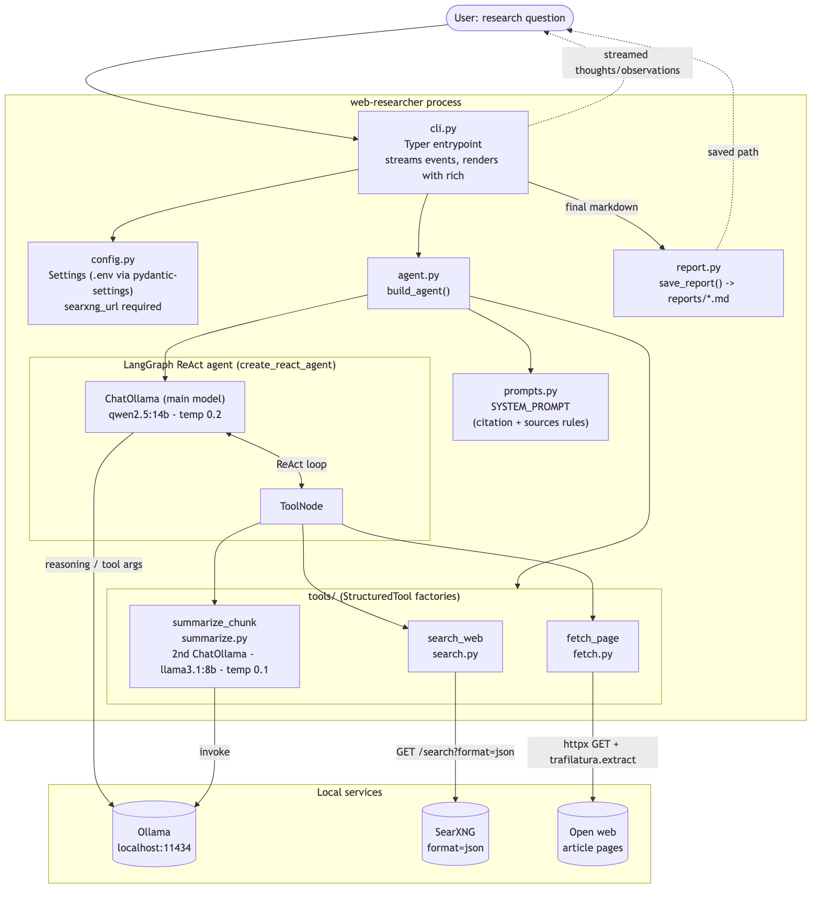
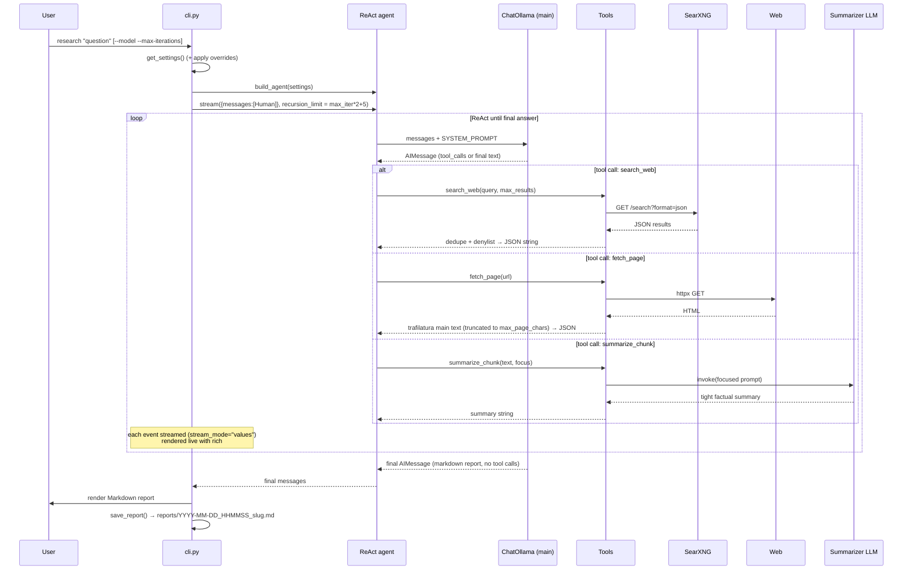

# Architecture

A local-first CLI research agent. **Ollama** reasons, **SearXNG** searches,
**LangGraph**'s prebuilt ReAct agent (`create_react_agent`) ties them together.
One invocation = one question in, a streamed report out.

> PNG renders: [docs/architecture-component.png](docs/architecture-component.png)
> and [docs/architecture-sequence.png](docs/architecture-sequence.png).

## Component diagram



```mermaid
flowchart TD
    user([User: research "question"]) --> cli

    subgraph proc["web-researcher process"]
        cli["cli.py<br/>Typer entrypoint<br/>streams events, renders with rich"]
        cfg["config.py<br/>Settings (.env via pydantic-settings)<br/>searxng_url required"]
        agentmod["agent.py<br/>build_agent()"]
        prompts["prompts.py<br/>SYSTEM_PROMPT<br/>(citation + sources rules)"]
        report["report.py<br/>save_report() → reports/*.md"]

        subgraph graph["LangGraph ReAct agent (create_react_agent)"]
            llm["ChatOllama (main model)<br/>qwen2.5:14b · temp 0.2"]
            toolnode["ToolNode"]
        end

        subgraph tools["tools/ (StructuredTool factories)"]
            search["search_web<br/>search.py"]
            fetch["fetch_page<br/>fetch.py"]
            summarize["summarize_chunk<br/>summarize.py<br/>2nd ChatOllama · llama3.1:8b · temp 0.1"]
        end
    end

    subgraph external["Local services"]
        ollama[("Ollama<br/>localhost:11434")]
        searxng[("SearXNG<br/>format=json")]
        web[("Open web<br/>article pages")]
    end

    cli --> cfg
    cli --> agentmod
    agentmod --> prompts
    agentmod --> llm
    agentmod --> tools
    cli -- final markdown --> report

    llm <-->|ReAct loop| toolnode
    toolnode --> search
    toolnode --> fetch
    toolnode --> summarize

    llm -->|reasoning / tool args| ollama
    search -->|GET /search?format=json| searxng
    fetch -->|httpx GET + trafilatura.extract| web
    summarize -->|invoke| ollama

    cli -. streamed thoughts/observations .-> user
    report -. saved path .-> user
```

## Control flow (one run)




## Key design points

- **ReAct loop**: `create_react_agent` alternates LLM node ↔ ToolNode. Each step is
  ~2 graph nodes, so the recursion limit is `max_iterations * 2 + 5` ([cli.py:78](src/web_researcher/cli.py#L78)).
- **Tool factories**: every tool is built by `make_*_tool(settings)` returning a
  `StructuredTool` that closes over `Settings` (no env reads at call time).
- **Tools return JSON strings**, never raise — errors come back as
  `{"error": "..."}` so the agent decides how to react.
- **Two models**: the main reasoner (`qwen2.5:14b`) drives the loop; a smaller
  summarizer (`llama3.1:8b`) compresses long pages on demand.
- **Streaming**: the CLI consumes `agent.stream(..., stream_mode="values")` and
  renders thoughts, tool calls, and observations live; the final no-tool-call
  `AIMessage` is the report, which is then saved to `reports/`.
- **Lazy tool imports** ([tools/__init__.py](src/web_researcher/tools/__init__.py)):
  importing one tool (e.g. for tests) doesn't force-load Ollama.
- **Fail-loud config**: `searxng_url` has no default ([config.py:20](src/web_researcher/config.py#L20)).
```
